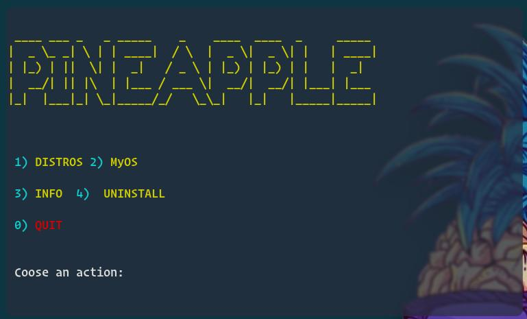
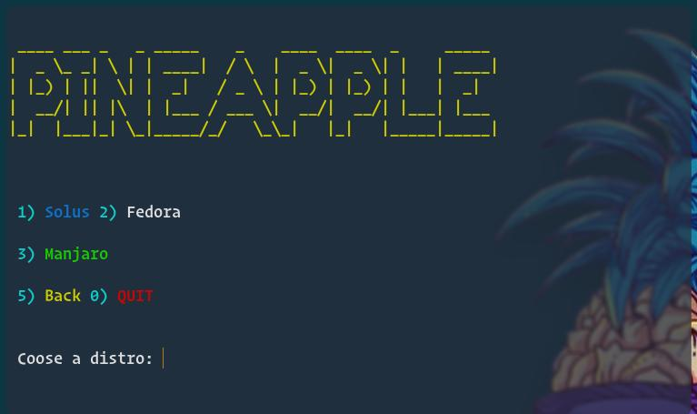
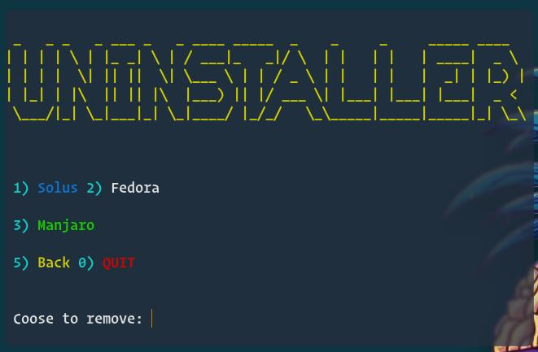
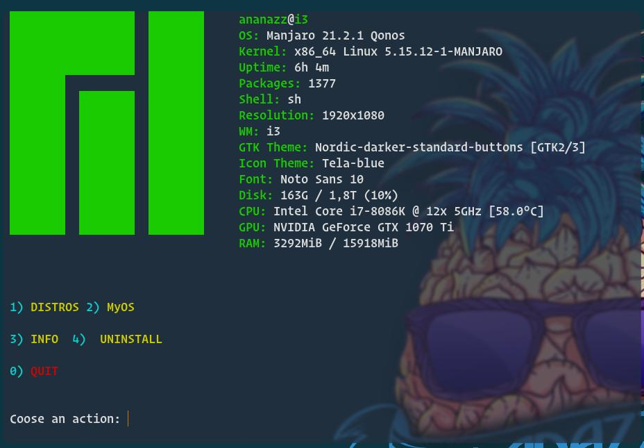
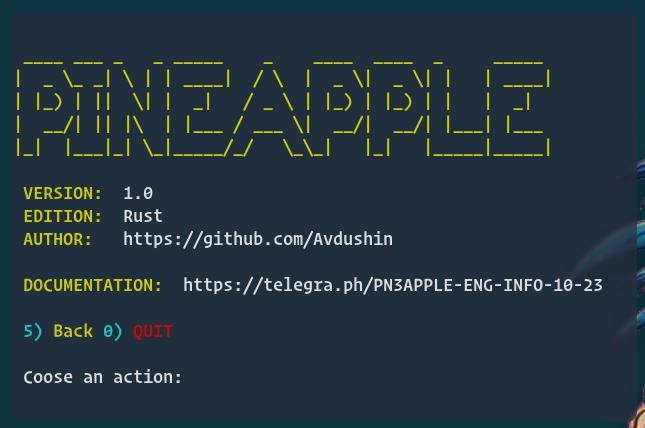

### INSTALLATION / УСТАНОВКА

`git clone https://github.com/Avdushin/rustapple`

` cd rustapple/`

`./install.sh`

` ./pineapple.sh` or ` cargo run .`

### [ABOUT]

Rustapple it's a copy of  [PIN3APPLE](https://github.com/Avdushin/PIN3APPLE) written in Rust

#### [ENG] DEMO

##### MAIN MENU

##### DOSTRO MENU

##### UNINSTALLER

##### OS INFO

##### ABOUT

